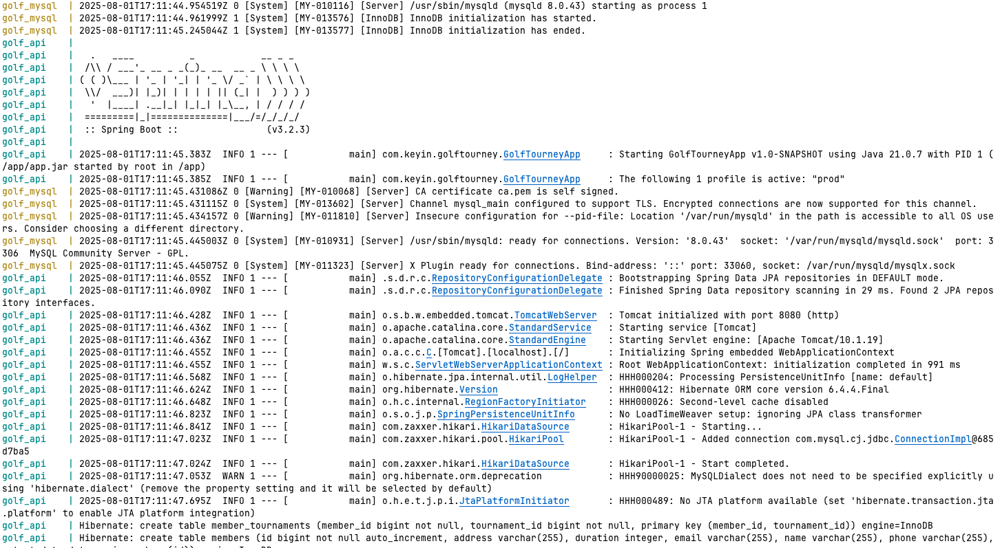
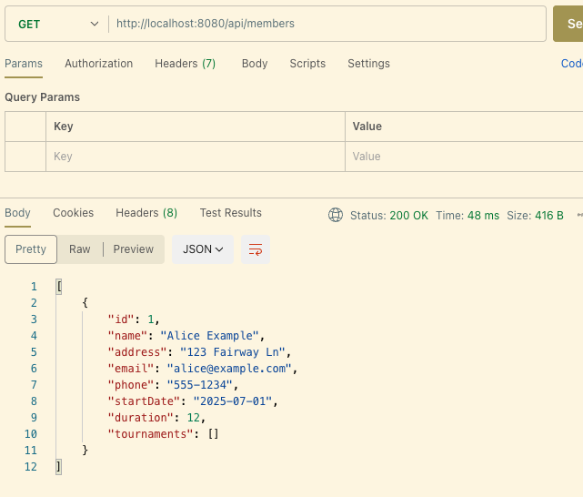
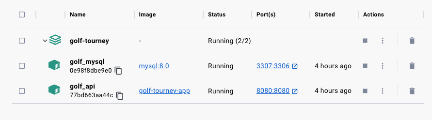

# Golf Tourney API

A simple Spring Boot REST API for managing golf club members and tournaments, backed by a MySQL database (or H2 for dev) and containerized with Docker.

---

## Features

* Add/Get Members and Tournaments
* Enroll members in tournaments
* Search members by name, phone, or tournament date
* Search tournaments by start date or location
* Supports H2 (in-memory) for dev and MySQL via Docker Compose

---

## Prerequisites

* **Java 21**
* **Maven 3.9+**
* **Docker & Docker Compose**
* (Optional) MySQL Workbench or any MySQL client for inspecting the database

---

## Getting Started

1. **Clone the repo**

   ```bash
   git clone https://github.com/youruser/golf-tourney.git
   cd golf-tourney
   ```

2. **Build locally** (optional, uses H2 dev by default)

   ```bash
   mvn clean package
   java -jar target/golf-tourney-1.0-SNAPSHOT.jar
   ```

3. **Run with Docker** (MySQL)

   ```bash
   docker-compose up --build
   ```

    * API available at `http://localhost:8080`

---

## Docker Setup

```yaml
services:
  mysql:
    image: mysql:8.0
    environment:
      MYSQL_DATABASE: golfdb
      MYSQL_USER: user
      MYSQL_PASSWORD: password
      MYSQL_ROOT_PASSWORD: rootpassword
    ports:
      - "3306:3306"
  app:
    build: .
    ports:
      - "8080:8080"
    depends_on:
      - mysql
    environment:
      SPRING_PROFILES_ACTIVE: prod
      SPRING_DATASOURCE_URL: jdbc:mysql://mysql:3306/golfdb?characterEncoding=utf8&useSSL=false&allowPublicKeyRetrieval=true
      SPRING_DATASOURCE_USERNAME: user
      SPRING_DATASOURCE_PASSWORD: password
```

---

## API Endpoints

| Method | Endpoint                                  | Description                                  |
| ------ | ----------------------------------------- | -------------------------------------------- |
| POST   | `/api/members`                            | Create a new member                          |
| GET    | `/api/members`                            | List all members                             |
| GET    | `/api/members/{id}`                       | Get member by ID                             |
| GET    | `/api/members/search?name=Alice`          | Search members by name, phone, or date       |
| POST   | `/api/tournaments`                        | Create a new tournament                      |
| GET    | `/api/tournaments`                        | List all tournaments                         |
| GET    | `/api/tournaments/{id}`                   | Get tournament by ID                         |
| GET    | `/api/tournaments/search?location=Pebble` | Search tournaments by start date or location |
| POST   | `/api/tournaments/{tid}/members/{mid}`    | Enroll a member in a tournament              |
| GET    | `/api/tournaments/{tid}/members`          | List participants of a tournament            |

---

## Screenshots

Capture the following to showcase functionality:

1. **Docker Compose up logs**

    * Shows both MySQL and the app starting successfully.

   


2. **List Members**

    * Postman `GET /api/members` showing JSON array.

   


3. **Docker Desktop View**

    * Docker desktop showing both containers running:

   

---

## Future Improvements

* Externalize secrets via **.env** or AWS Secrets Manager.
* CI/CD pipeline for automated builds & deploys.

---

*Happy golfing!* ⛳️
